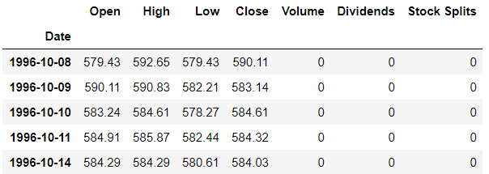
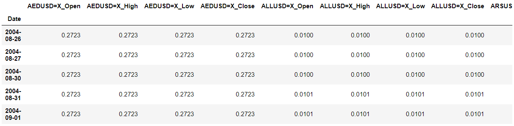
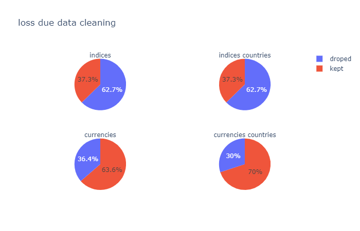
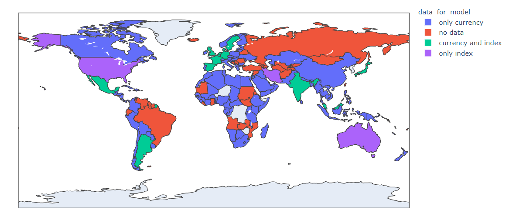
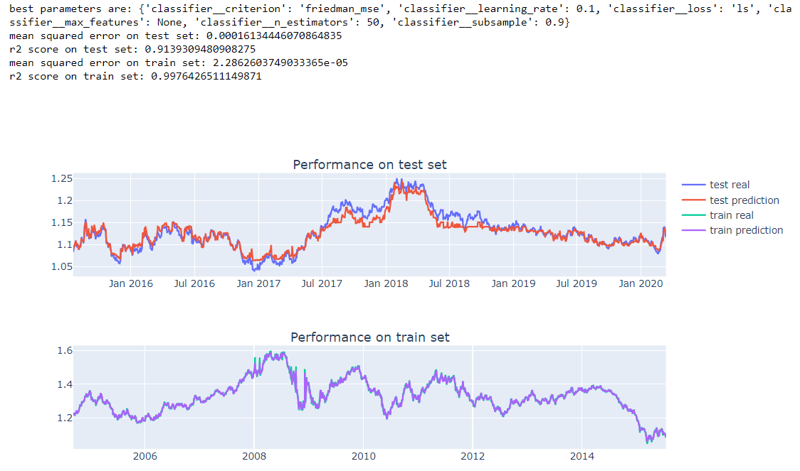
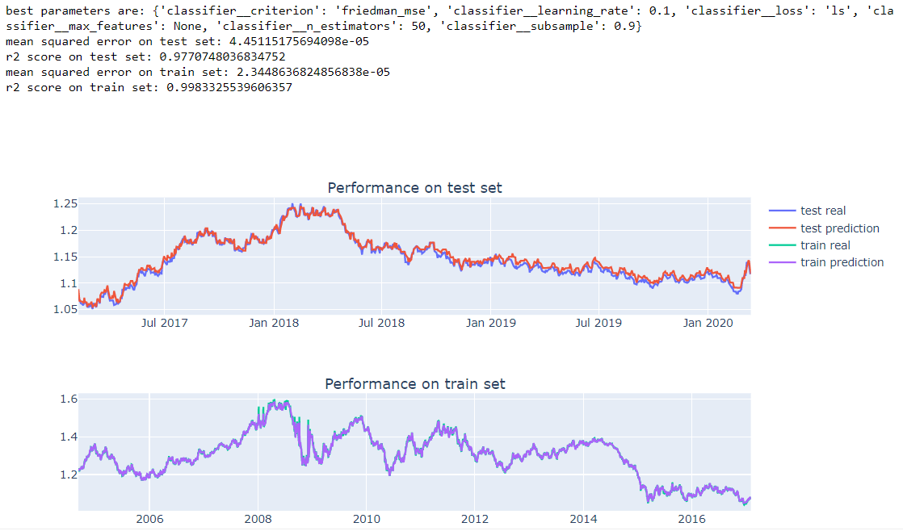

  

<h2 align="center">Multivariate time series prediction with scikit learn</h2>

  A brief analysis if it is possible to make good predictions on multivariate time series data with the supervised learning models within scikit learn library - by trying to predict the exchange rate of currencies. 
   
  <a href="https://github.com/jo-ai-chim/Currency_Predictor_Project/"><strong>Explore the code »</strong></a>

**What is this all about?**

After I discovered the scikit learn framework a little deeper I was quite enthusiastic about it. The possibilities to set up pipelines and combine them with gridsearch to keep the code structured and optimize a model totally catched me. 

When I then first tried to make a prediction for time series data I found a lot of possibilities on the web. From using deep learning neuronal networks like LSTM (long short term memory) from tensorflow or pytorch over the facebook Prophet package to using different models like Vector Auto Regression (VAR) or ARIMA from the statsmodels module.

Unfortunately I found very little input on how to make time series predictions using scikit learn package - especially for multivariate input. So I wondered if it is even possible to make good time series predictions with the supervised learning models in scikit learn. 

Since most of the time series projects you find are concerning financial data, I decided to also chose a use case from this area. But I didn't want to spend money to get some financial data. So I set myself the goal to 

*make a prediction for currency exchange rates on the next day based on the scikit learn supervised learning models and open financial data.* 

To reach this goal I came up with the following **strategy**:

1. First I searched for open financial data and analysed if it is good enough to build a supervised model on it.
2. Then I looked for the best model wihtin scikit learn to use for the prediction.
3. And as a final step I tried to optimize this model. 

**Get the data.**

First of all I thought about what metric should the data needs to justify. For my model I first of all wanted to use as many currency exchange rates between a currency and the dollar I can. Moreover I wanted to use wanted to use as many stock market indices worldwide. The idea behind it was that by the indices I get features to represent the demand of an currency and with the exchange rates I get features to describe the offer. For this features I set myself the boarder of 3.500 datapoints at least I can use to train and test my model. 

After having this imagination of the data I was looking for I needed to find the corresponding open financial data. Luckily I found this [article](https://towardsdatascience.com/best-5-free-stock-market-apis-in-2019-ad91dddec984) dealing with this topic. Here I first tried the yfinance API. When calling it with a specific currency or index I got the following data back:

  

So this directly looked pretty promising. Based on wikipedia I set up a list for all currencies I want to have for the model and queried the yfinance data for all of them. Then them into one dataframe with 4 columns (open, low, high and close value) for each currency. For the indices I did the same. 

Afterwards I cleaned the data so that I only kept the currencies and indices for which I have at least data for 3.500 datapoints into the past. This resulted in two dataframes looking like:

  

Then I checked the lost due to data cleaning. Unfortunately I had to drop 62.7% of all the indices I tried to get data for. Even this is quite it is not too bad since there are so many indices in the world that I could easily increase the input in this area. For the currencies it was lookily a lot better. For 7ß0 % of all provided countries I could keep at least one currency. So in total I had 19 indices and currencies for 163 countries to train my model.

  

I also took a look at a world map to get a better feeling on how good the coverage of the gotten data is. As you can see from the map below it is quite good. Therefore I thought it is time to start the search for a model. 

  

**Find the best scikit learn model.**

First I thought of a metric to defines when a model performs good. I decided to take two values into consideration. The mean squared error to see how far the predicted values are from the actual ones over all. Since this value doesn't really consider how well the prediction follows the trends of the actual values I also added the r2 score to my metric.

With the metric set up I chose the four most promising models within scikit learn:

- In regards to the (linear) ARIMA models which are often used for time series forecasts I chose to take a look at scikit learn's Lasso model.
- Since different neuronal networks are often set up to make predictions based on time series data I decided to give scikit learn's MLPRegressor a shot.
- Moreover I thought that decision trees should also be able to make good predicitions in our case since they should be able to get the correlations between the different input values well I also chose to investigate the RandomForestRegressor.
- Last but not least I considered scikit learn's GradientBoostingRegressor since I thought the combination of the differentiable loss functions with a decision tree is quite promising in our regards.

After setting up the same frame for all models (like a custom train test split which simply splits the data at a specific date) and adding values from the past days as additional features to each datapoint I did a grid search for each of the models. The result for each model you can see in the tabel below. 

| Model                     | mean squared error test  | r2 score test      | mean squared error train  | r2 score train     |
| ------------------------- | ------------------------ | ------------------ | ------------------------- | ------------------ |
| Lasso                     | 0.0001301024389039277    | 0.9305969754502278 | 9.516375287926458e-05     | 0.9901877244951565 |
| RandomForestRegressor     | 0.00012147487839064245   | 0.9351993395500302 | 9.451654721419876e-06     | 0.9990254457469654 |
| MLPRegressor              | 0.0062001852300656805    | -2.307483021537676 | 0.00019987267312134902    | 0.9793912527068535 |
| GradientBoostingRegressor | 0.00016134446070864835   | 0.9139309480908275 | 2.2862603749033365e-05    | 0.9976426511149871 |

Notes: 
- Unfortunately the grid search really reached it's limits. My first try to loop through the models and gridsearch them wasn't finished after 48h so I stopped it and did the grid search in several steps.
- The neuronal Network didn't perfrom as good as the other models even I tried most parameters here within the grid search. Since neuronal networks are often taken to make predictions for time series data this was quite surprising. Therefore it might be worth to take here a deeper look and try more parameters. Since the other models already performed so well I accepted this for the moment.

So the three models Lasso, Random Forrest and Gradient Boosting perform quite similar. 

Even Lasso and Random Forest are slightly better than Gradient Boosting I chose Gradient Boosting to continue with. Since for the purpose to show that scikit learn is capable of making time series predictions taking a scikit learn specific model like gradient boosting over the linear model lasso makes more sense. Further more I thought that compared to Random Forrest it leaves more space for improvements and the effect of the tried measure to improve the model are clearer.

Here you can see the performance of the GradientBoostingRegressor after grid search:

  

**Optimize the GradientBoostingRegressor.**

Even it is already shown that you can make good predictions with the supervised models in scikit for time series topics, I want to try to improve the model even more.

The first try is to change the train test split ration. Since all models above perfromed much better on the train set I decided first to decrease the train set size. 

Surprisingly this didn't improve the model but (it even made the prediction worse) but I can be sure not to deal with a case of over fitting. And indeed when I then increased the train set size the model got even better. 

It is a general known that supervised learning models normally perform better on stationary data. To check if I can this way improve the model I switch for the labels to the differences between the actual value and the value the day before. Unfortunately in our case this made the model useless so I undid the change directly.

Next I took a look at the number of features. Before checking if the model is dealing with the curse if dimensionality I reduced the features and tossed for each of the currencies and indices all values except the one from the label (so if the label is an open value I dropped everything except the open values). This made the model a little bit worse so I decided to add more features. Since we are dealing with time series data I added time data like the day of the week, month and day of the month. This improved the model a little bit.

So it underlined the assumption that the model can still be improved even more by adding more relevant features. But with a mean squared error of 0.000045 and a r2 score of 0.98 the model is good for now.

  

  

**Check scalability and robustness.**

As a final check I wanted to take a look on the scalability and robustness of the model. Therefore I decided to switch the currency to predict and set up the same model for some other currencies. I picked some countries from all over the world and especially also some currencies for which no index was provided.

For the European currencies the resulting model performed quite the same no matter if a index is in the features or not. For Asian currencies however the results was also still ok but not too good anymore. But for African or South American currencies the results got pretty bad. 

| Country                      | mean squared error test  | r2 score test      | mean squared error train  | r2 score train     |
| ---------------------------- | ------------------------ | ------------------ | ------------------------- | ------------------ |
| Denmark (currency and index) | 0.0062001852300656805    | -2.307483021537676 | 0.00019987267312134902    | 0.9793912527068535 |
| Japan (currency and index)   | 0.00016134446070864835   | 0.9139309480908275 | 2.2862603749033365e-05    | 0.9976426511149871 |
| Switzerland (only currency)  | 0.0001301024389039277    | 0.9305969754502278 | 9.516375287926458e-05     | 0.9901877244951565 |
| China (only currency)        | 0.00012147487839064245   | 0.9351993395500302 | 9.451654721419876e-06     | 0.9990254457469654 |
| Urugay (only currency)       | 0.0062001852300656805    | -2.307483021537676 | 0.00019987267312134902    | 0.9793912527068535 |
| Egypt (only currency)        | 0.00016134446070864835   | 0.9139309480908275 | 2.2862603749033365e-05    | 0.9976426511149871 |

Having the results from the ETL notebook in mind this absolutely makes sense. Since we have most input data for European and North American area. For Asia we have less values and for the Africa and South America we have even less values so the correlation between our features and the labels is not too big anymore.

**Let's wrap it up.**

So to sum it up I think having the scores of the final model in mind it is clear that it is possible to make good predictions with the supervised learning models in scikit learn for multivariate time series problems.

But I want to highlight some findings I made during my investigations:

- There is so much open (financial) data out there to build good and reliable models on.
- One of the most appealing features of scikit learn - the grid search functionality - was realtively fast taken to it's limit.
- Surprisingly the neuronal network of scikit learn performed so bad even neuronal networks are often taken for time series data. 

Based on this findings and the results above I think some good next steps and further improvements would be:

- As seen above when adding some features or checking the performance on other currencies the performance and robustness should improve by simply adding more features like missing currencies, indices or whole different features like the gold price to the input. Here it might be good to consider additional data sources. 
- The gridsearch was almost at it's limit. Therefore I didn't had the time to optimize all possible parameters. So here are quite a view options left to optimize the model further. First of all the scaler should be checked (maybe for some models a RobustScaler, QuantileTransformer, or Normalizer would lead to a better performance). Also the functions (like the train test split and the creation of the time data features, etc.) could be implemented as transformers and then be considered during grid search. 
